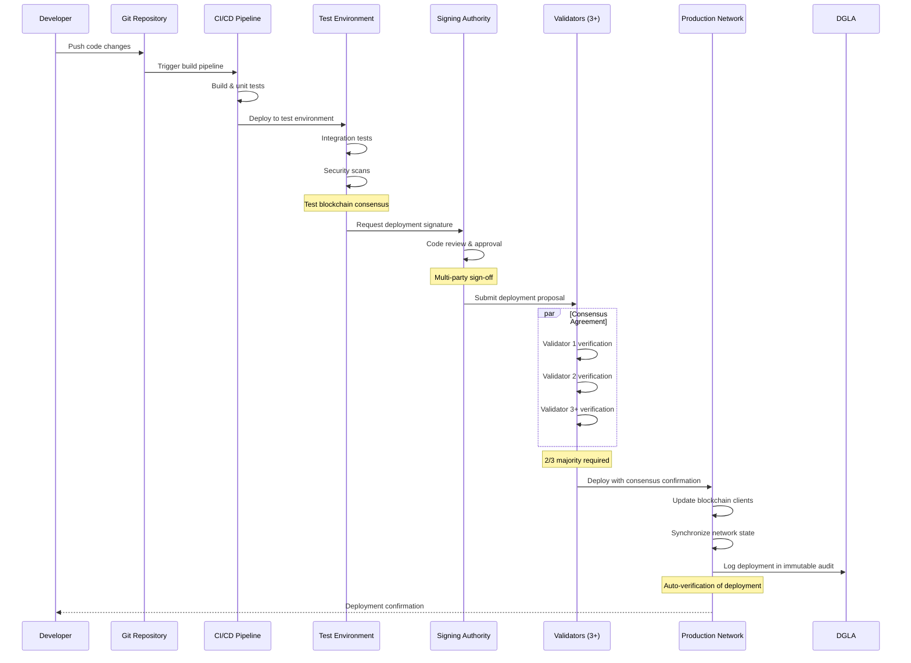
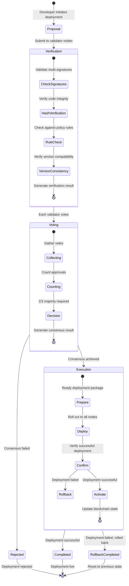

# DGLA Infrastructure Architecture Diagram

## Security & Infrastructure Layers

```mermaid
flowchart TB
    %% Define node styles
    classDef apiLayer fill:#f9f,stroke:#333,stroke-width:2px;
    classDef businessLayer fill:#bbf,stroke:#333,stroke-width:2px;
    classDef dataLayer fill:#bfb,stroke:#333,stroke-width:2px;
    classDef securityLayer fill:#fbb,stroke:#333,stroke-width:2px;
    classDef networkLayer fill:#fbf,stroke:#333,stroke-width:2px;
    classDef deployLayer fill:#ff9,stroke:#333,stroke-width:2px;
    
    %% Layer Headers
    subgraph "Layer 6: Deployment & Lifecycle Management"
        CICD["CI/CD Pipeline"] :::deployLayer
        DEPLOY["Deployment Manager"] :::deployLayer
        AGREE["Consensus Agreement"] :::deployLayer
        AUDIT_D["Deployment Audit"] :::deployLayer
    end
    
    subgraph "Layer 5: Application & Interface Layer"
        API["5G Network Slice API"] :::apiLayer
        CLI["Rogers CLI Tools"] :::apiLayer
        UI["Visualization Dashboard"] :::apiLayer
    end
    
    subgraph "Layer 4: Business Logic Layer"
        SLICE["Network Slice Manager"] :::businessLayer
        IOT["IoT Device Manager"] :::businessLayer
        MONITOR["Real-time Monitor"] :::businessLayer
        MGMT["Configuration Management"] :::businessLayer
    end
    
    subgraph "Layer 3: Data Governance Layer"
        DGLA["DGLA Core Platform"] :::businessLayer
        VERIFY["Cryptographic Verifier"] :::businessLayer
        REPAIR["Self-healing System"] :::businessLayer
        AUDIT["Immutable Audit Log"] :::businessLayer
    end
    
    subgraph "Layer 2: Blockchain Layer"
        BLOCK["Blockchain Storage"] :::dataLayer
        MERKLE["Merkle Tree Validation"] :::dataLayer
        MINE["Block Mining & PoW"] :::dataLayer
        PKI["Public Key Infrastructure"] :::dataLayer
    end
    
    subgraph "Layer 1: Distributed Security Layer"
        DCON["Distributed Consensus"] :::securityLayer
        SYNC["Node Synchronization"] :::securityLayer
        KEYS["Deterministic Key Store"] :::securityLayer
        TAMPER["Tamper Detection"] :::securityLayer
    end
    
    %% Deployment interactions with other layers
    CICD -->|Automated Build| DEPLOY
    DEPLOY -->|Versioned Release| API & CLI & UI
    AGREE -->|Version Consensus| DCON & DEPLOY
    AUDIT_D -->|Records Deployments| AUDIT
    DEPLOY -.->|Configuration| MGMT
    
    %% Components within each layer
    API -->|API calls| SLICE & IOT
    CLI -->|Commands| SLICE & MGMT
    UI -->|Visualizes| MONITOR & AUDIT
    
    SLICE -->|Slice Operations| DGLA
    IOT -->|Device Registry| DGLA
    MONITOR -->|Status Checks| DGLA & VERIFY
    MGMT -->|Config Changes| DGLA
    
    DGLA -->|Store Data| BLOCK
    VERIFY -->|Validate Hashes| MERKLE & TAMPER
    REPAIR -->|Fix Integrity| BLOCK & MERKLE
    AUDIT -->|Log Events| BLOCK
    
    BLOCK -->|Consensus| DCON
    MERKLE -->|Verify Integrity| TAMPER
    MINE -->|Create Blocks| BLOCK
    PKI -->|Sign/Verify| KEYS
    
    DCON -->|Distribute Data| SYNC
    SYNC -->|Verify Nodes| PKI
    KEYS -->|Generate Keys| PKI
    TAMPER -->|Alert on Attack| REPAIR
    
    %% Security flows across layers
    TAMPER -.->|Triggers| REPAIR
    VERIFY -.->|Reports to| MONITOR
    KEYS -.->|Authenticates| VERIFY
    PKI -.->|Secures| API
```

## Developer Deployment Workflow



## Node Consensus Process


```

## DGLA Security Architecture: Layer-by-Layer Explanation

### Layer 1: Distributed Security Layer
- **Distributed Consensus**: Ensures all nodes agree on blockchain state
  - *Security Features*: Byzantine Fault Tolerance, multi-node validation
  - *Attack Prevention*: Prevents 51% attacks, single-node compromise
  
- **Node Synchronization**: Keeps all nodes updated with latest blockchain
  - *Security Features*: Peer validation, timestamp verification
  - *Attack Prevention*: Prevents forked chains, outdated state attacks
  
- **Deterministic Key Store**: Manages cryptographic keys
  - *Security Features*: Deterministic generation, secure storage
  - *Attack Prevention*: Prevents key forgery, ensures consistent verification
  
- **Tamper Detection**: Identifies unauthorized modifications
  - *Security Features*: Real-time monitoring, hash verification
  - *Attack Prevention*: Detects priority manipulation, configuration changes

### Layer 2: Blockchain Layer
- **Blockchain Storage**: Stores immutable network slice data
  - *Security Features*: Linked blocks, cryptographic proofs
  - *Attack Prevention*: Prevents data manipulation, ensures immutability
  
- **Merkle Tree Validation**: Efficiently verifies data integrity
  - *Security Features*: O(log n) verification, path authentication
  - *Attack Prevention*: Ensures data consistency, detects partial changes
  
- **Block Mining & PoW**: Creates secure, verified blocks
  - *Security Features*: Computational work proof, adjustable difficulty
  - *Attack Prevention*: Prevents spam blocks, ensures consensus cost
  
- **Public Key Infrastructure**: Manages identity and signatures
  - *Security Features*: Certificate hierarchy, signature validation
  - *Attack Prevention*: Prevents identity spoofing, ensures non-repudiation

### Layer 3: Data Governance Layer
- **DGLA Core Platform**: Central governance orchestration
  - *Security Features*: Policy enforcement, centralized control
  - *Attack Prevention*: Enforces access rules, manages authorization
  
- **Cryptographic Verifier**: Validates data authenticity
  - *Security Features*: Multi-algorithm verification, signature checking
  - *Attack Prevention*: Prevents acceptance of invalid data, ensures origin authenticity
  
- **Self-healing System**: Repairs blockchain integrity issues
  - *Security Features*: Autonomous repair, fork selection
  - *Attack Prevention*: Maintains chain integrity, recovers from attacks
  
- **Immutable Audit Log**: Records all system activities
  - *Security Features*: Tamper-evident logging, cryptographic timestamps
  - *Attack Prevention*: Ensures accountability, enables forensic analysis

### Layer 4: Business Logic Layer
- **Network Slice Manager**: Manages 5G network slices
  - *Security Features*: Priority enforcement, slice isolation
  - *Attack Prevention*: Prevents priority manipulation, maintains QoS
  
- **IoT Device Manager**: Handles IoT device registry
  - *Security Features*: Device authentication, behavioral monitoring
  - *Attack Prevention*: Detects compromised devices, enforces access control
  
- **Real-time Monitor**: Monitors system health and threats
  - *Security Features*: Anomaly detection, alert generation
  - *Attack Prevention*: Provides early warning, enables rapid response
  
- **Configuration Management**: Manages system configuration
  - *Security Features*: Change tracking, validation checks
  - *Attack Prevention*: Prevents unauthorized config changes, ensures compliance

### Layer 5: Application & Interface Layer
- **5G Network Slice API**: External API for slice operations
  - *Security Features*: Rate limiting, input validation
  - *Attack Prevention*: Prevents API abuse, injection attacks
  
- **Rogers CLI Tools**: Command-line tools for operations
  - *Security Features*: Authentication, privilege separation
  - *Attack Prevention*: Enforces least privilege, validates commands
  
- **Visualization Dashboard**: UI for monitoring and management
  - *Security Features*: Role-based access, secure communications
  - *Attack Prevention*: Enforces visualization restrictions, prevents information leakage

## Security Data Flow

1. **Authentication Flow**:
   - External request → API authentication → PKI verification → Access granted/denied

2. **Network Slice Creation**:
   - Slice request → Validation → Block creation → Mining → Consensus → Confirmation

3. **Attack Detection**:
   - Tampering attempt → Hash verification failure → Alert generation → Remediation

4. **Auto-Repair Sequence**:
   - Integrity failure → Tampered block identification → Chain repair → Verification

5. **Audit Trail**:
   - System event → Cryptographic logging → Blockchain storage → Immutable record
